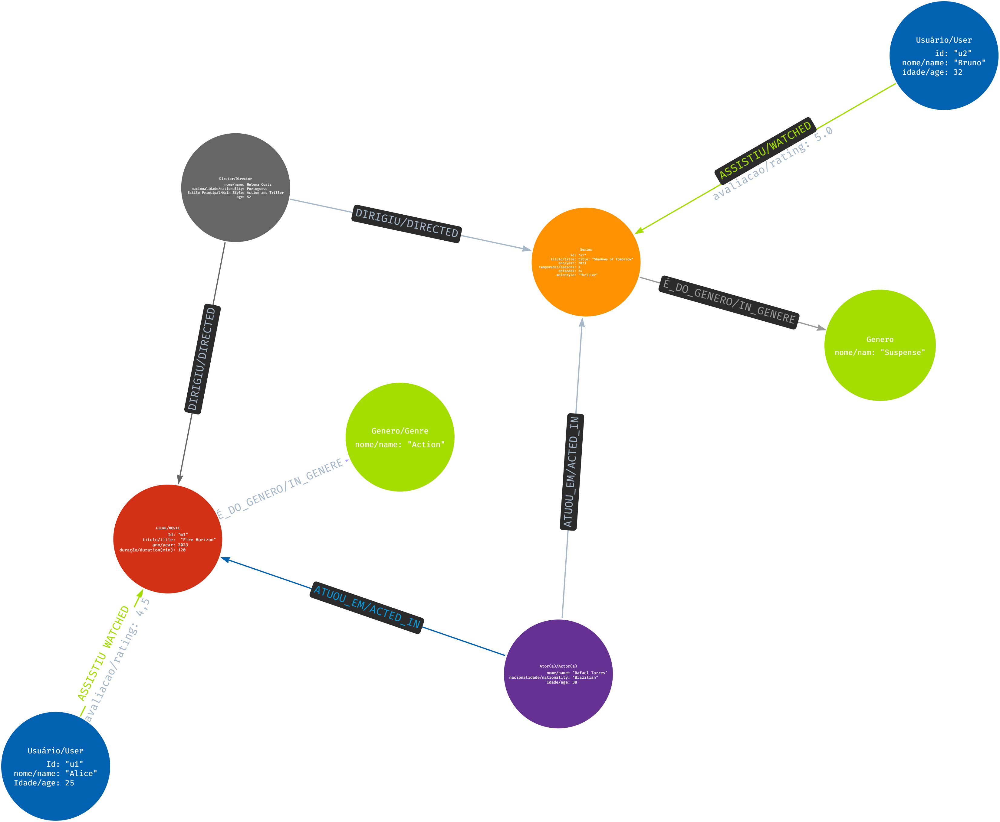

# 📊 Modelo de Grafo para Streaming — CineGraph

Este documento descreve a estrutura técnica do grafo utilizado no projeto **CineGraph**, modelado em Neo4j para representar um serviço de streaming com recomendações inteligentes.

---

## 🧩 Nós (Nodes)

- **User**
  - Propriedades: `name`, `email`, `age`
  - Representa um usuário da plataforma

- **Movie**
  - Propriedades: `title`, `year`, `duration`, `mainStyle`
  - Representa um filme disponível no catálogo

- **Series**
  - Propriedades: `title`, `year`, `duration`, `mainStyle`
  - Representa uma série disponível no catálogo

- **Genre**
  - Propriedades: `name`
  - Classificação de obras (ex.: Drama, Sci-Fi, Mystery)

- **Director**
  - Propriedades: `name`, `nationality`
  - Representa um diretor de filmes ou séries

- **Actor**
  - Propriedades: `name`, `birthYear`
  - Representa um ator que participou de obras

---

## 🔗 Relacionamentos (Relationships)

- **WATCHED** → `User` → `Movie/Series`  
  Indica que o usuário assistiu à obra

- **RATED** → `User` → `Movie/Series`  
  Avaliação dada pelo usuário (nota)

- **IN_GENRE** → `Movie/Series` → `Genre`  
  Classifica a obra em um ou mais gêneros

- **DIRECTED** → `Director` → `Movie/Series`  
  Indica que o diretor dirigiu a obra

- **ACTED_IN** → `Actor` → `Movie/Series`  
  Indica que o ator participou da obra

- **RECOMMENDED** → `User` → `Movie/Series`  
  Sugestão gerada pelo sistema para o usuário

---

## 🧠 Exemplo de uso

- Usuário **Bruno** assistiu ao filme *Echoes of Silence* (Drama) e à obra *The Last Portal* (Sci-Fi).  
- Usuário **Alice** assistiu à obra *Invisible Legacy* (Mystery).  
- O sistema recomenda *Infinite Mystery* para ambos, pois pertence a gêneros similares e foi dirigido por um diretor favorito.

---

## 📌 Visualização

A estrutura pode ser visualizada no diagrama abaixo:



---

## 🛠️ Considerações técnicas

- O grafo é orientado por relacionamentos, permitindo consultas eficientes como:
  - Obras mais assistidas
  - Gêneros favoritos por usuário
  - Recomendações baseadas em comportamento
- As propriedades como `duration`, `year` e `mainStyle` enriquecem as análises e recomendações.
- O modelo é extensível para incluir avaliações (`RATED`) e interações sociais (ex.: amigos, comentários).

---

## 📚 Exemplo Cypher

```cypher
// Recomendar obras do mesmo gênero
MATCH (u:User)-[:WATCHED]->(w1)-[:IN_GENRE]->(g:Genre)<-[:IN_GENRE]-(w2)
WHERE NOT (u)-[:WATCHED]->(w2)
RETURN u.name AS usuario, g.name AS genero_favorito, w2.title AS recomendacao, w2.duration AS duracao_minutos;
